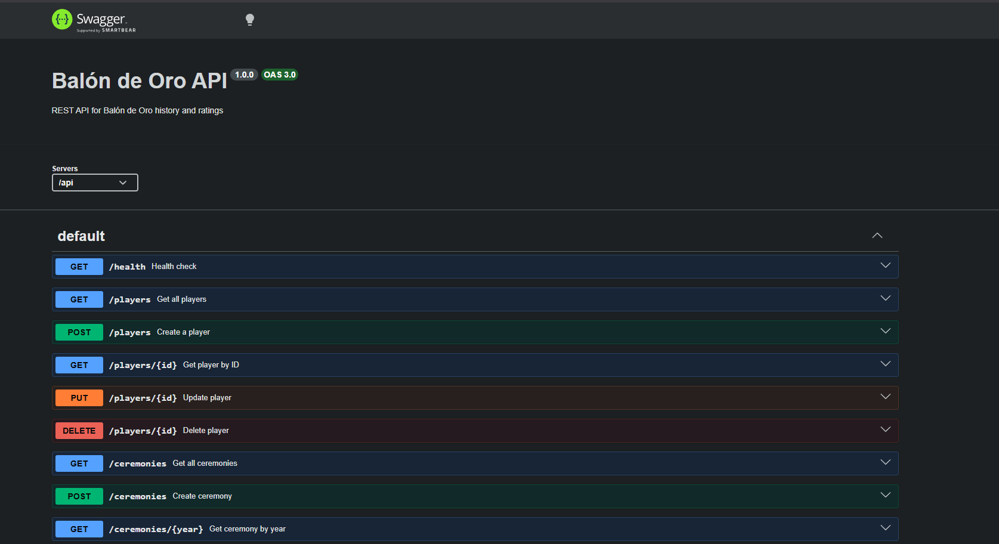
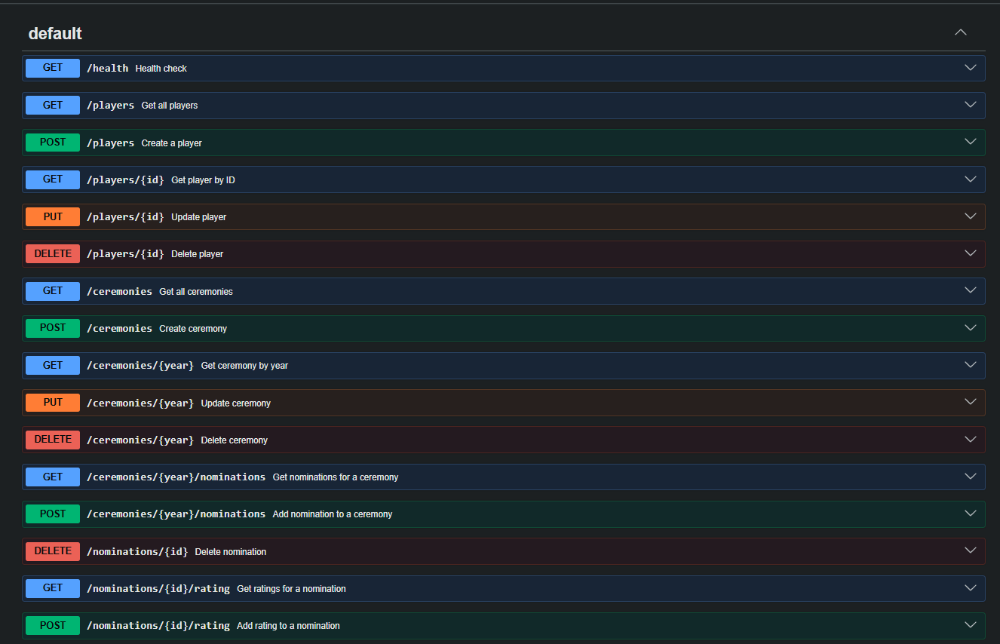
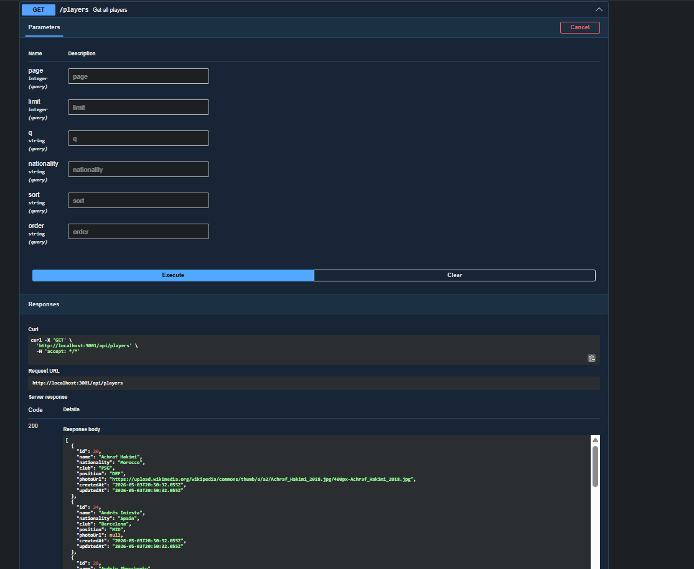
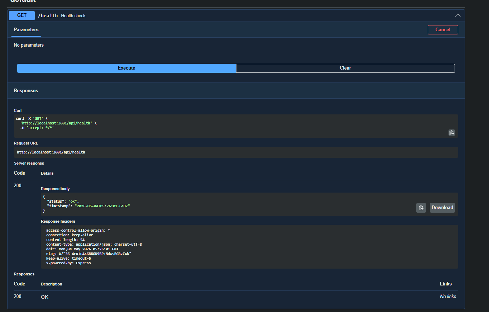

# Balón de Oro API

REST API for exploring the history of the Balón de Oro and rating nominees.

## Database Setup

This project uses **Supabase** (PostgreSQL) with **Transaction Pooler** for serverless compatibility.

### Why Transaction Pooler?

Vercel is serverless (stateless), so Transaction Pooler is required to avoid exhausting PostgreSQL connection limits. Each serverless function creates new connections, and without pooling, you'd quickly hit the connection limit.

### Setup Steps

1. Create a free project at [supabase.com](https://supabase.com)
2. Go to **Settings → Database → Connection string**
3. Select **"Transaction pooler"** mode (port 6543)
4. Copy the URI
5. Replace `[YOUR-PASSWORD]` with your project password
6. Paste it as `DATABASE_URL` in your `.env` file
7. Run migrations:
   ```bash
   npm run migrate
   npm run seed
   ```

## CORS Configuration

CORS (Cross-Origin Resource Sharing) is a security feature that restricts how resources on a web page can be requested from another domain outside the domain from which the resource originated; it was configured to allow requests from the origin specified in the `ALLOWED_ORIGIN` environment variable (defaulting to `*`).

## How to run locally

1.  **Clone the repository**
2.  **Install dependencies**:
    ```bash
    npm install
    ```
3.  **Configure environment variables**:
    Create a `.env` file based on `.env.example` and provide your Supabase and Cloudinary credentials.
4.  **Database setup**:
    Follow the [Database Setup](#database-setup) section above.
5.  **Start the server**:
    ```bash
    npm run dev
    ```
6.  **Explore the API**:
    Visit `http://localhost:3001/api/docs` to see the Swagger documentation.

## Implemented Challenges
- [x] Hexagonal Architecture (Ports & Adapters)
- [x] Pure JavaScript implementation (No TypeScript)
- [x] Raw SQL with `pg` library (No ORM)
- [x] Image handling with Cloudinary v2 SDK
- [x] File uploads with `multer` (memoryStorage)
- [x] Server-side validation with `express-validator`
- [x] API documentation with Swagger (OpenAPI 3.0)
- [x] Vercel serverless deployment support

## Tech Stack Reflection
The tech stack chosen (Node.js, Express, pg, Cloudinary) is robust and highly performant for a serverless environment. Using raw SQL provides total control over queries and avoids the overhead of an ORM, which is beneficial for learning and fine-tuning. However, for larger projects, the lack of type safety from TypeScript and the manual mapping of SQL results to domain entities can become tedious. I would definitely use this stack again for lightweight, high-performance APIs or when strict control over the database layer is required.

## Live API
Production: https://proy1-balon-de-oro-api.vercel.app/

## Screenshots

### Swagger UI (API Documentation)


### API Endpoints


### Players - Get All


### Health Check


## Frontend Repository
[Link to frontend repo](https://github.com/asanabria-2021067/proy1-balon-de-oro-client)
